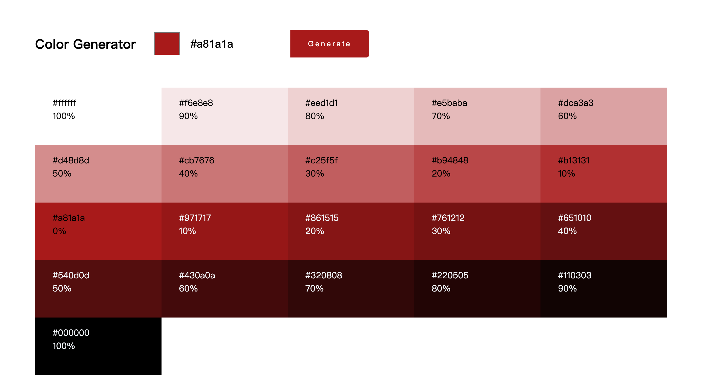

# Color Generator

通过颜色选择器选择颜色或直接输入颜色，点击按钮生成20中不同深浅的颜色。点击颜色可以直接复制颜色。
- 不同颜色通过 Values.js 生成
- 成功复制颜色后提示用户的弹窗使用 react-toastify
- 复制到剪贴板用自带的 Clipboard API



## Values.js

用 [Values.js Library](https://github.com/noeldelgado/values.js/blob/master/README.md) 生成不同颜色

1. Install
    ```sh
    npm i values.js
    ```
2. Usage
    ```jsx
    import Values from 'values.js';
    new Values('#f15025').all(10);
    ```

## React-Toastify

1. Install
    ```sh
    npm i react-toastify
    ```
2. Usage
    ```jsx
    // main.jsx
    import 'react-toastify/dist/ReactToastify.css';

    // App.jsx
    import { ToastContainer, toast } from 'react-toastify';

    toast.success('awesome');
    toast.error('error message');

    return (
    <main>
        // 其他代码
        <ToastContainer position='top-center' />
    </main>
    );
    ```

## Clipboard API

用 `navigator.clipboard` 访问系统剪贴板的 `Clipboard` 对象。它提供了读取和写入剪贴板内容的功能，可以用于实现网页应用程序中的剪切、复制和粘贴功能。然而，使用异步剪贴板读取和写入方法需要用户授予网站或应用程序访问剪贴板的权限。